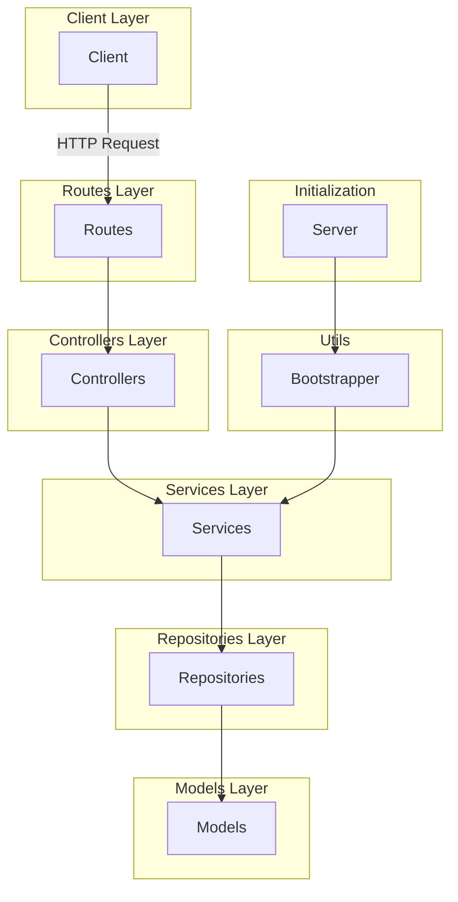

```mermaid
    graph TD
        Client -->|HTTP Request| Routes
        Routes --> Controllers
        Controllers --> Services
        Services --> Repositories
        Repositories --> Models
        Server --> Bootstrapper
        Bootstrapper --> Services 

        subgraph Client Layer
            Client
        end

        subgraph Routes Layer
            Routes
        end

        subgraph Controllers Layer
            Controllers
        end

        subgraph Services Layer
            Services
        end

        subgraph  Repositories Layer
            Repositories
        end

        subgraph Models Layer
            Models
        end

        subgraph Initialization
            Server
        end

        subgraph Utils
            Bootstrapper
            Services
        end

        subgraph Utils
            Bootstrapper
        end
```
